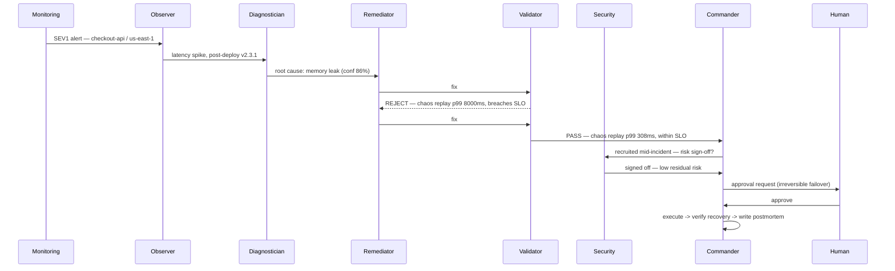

<div align="center">

# ⚡ Aegis

### Autonomous Incident Response — coordinated through Band

*Five specialist AI agents and a human, working an incident the way a great on-call team would: detect, diagnose, propose, challenge, approve, resolve — all in one live conversation.*


</div>

---

## The 30-second version

A production service starts failing at 2 a.m. A human on-call engineer would spend **~42 minutes** half-awake, digging through dashboards before the fix is even applied.

**Aegis resolves the same incident in ~90 seconds** — not with one model doing everything, but with **five specialist agents genuinely collaborating through Band**: handing off tasks, *challenging each other's work*, pulling in help when needed, and pausing for a human before anything irreversible touches production.

> The core beat isn't speed. It's **accountability** — one agent rejects another's fix, with a computed reason, and forces a better one. That's a team, not a pipeline.

---

## 🔥 The problem

On-call incident response is slow, lonely, and expensive:

- **Mean-time-to-resolution is measured in tens of minutes** — most of it spent on diagnosis, not the fix.
- **A single engineer carries the whole loop** — detect, diagnose, decide, and execute, often under pressure and alone.
- **Every minute of downtime costs money and trust**, and rushed fixes can make the outage worse.

Single-agent "AI ops" tools just move the bottleneck. One model still does everything, with no second opinion and no real division of labor.

---

## 🧩 The solution

Aegis runs a **war room of specialists** that coordinate *through Band* — each agent reacts to the others' messages over Band's live connection, exactly like teammates in a shared channel.

| Agent | Role |
|------|------|
| 🛰 **Observer** | Watches metrics; detects the anomaly and raises the incident |
| 🩺 **Diagnostician** | Reads the signal, finds the root cause |
| 🛠 **Remediator** | Proposes a concrete fix |
| 🚫 **Validator** | Stress-tests the fix with a chaos replay — and **rejects it if it fails** |
| 🔐 **Security** | *Recruited live, mid-incident,* to sign off on irreversible actions |
| 🧭 **Commander** | Runs the room, requests human approval, executes, files the postmortem |

---

## ⭐ What makes it different

**1. Collaboration happens *through* Band — not just posted to it.**
The agents are real reactive participants. Each one *receives* its peers' `@mentions` over Band's WebSocket and acts on them. The cascade isn't scripted by an orchestrator — it **emerges** from agents talking to each other.

**2. The reject-then-fix beat.**
The validator doesn't rubber-stamp. It runs a chaos replay, computes the projected impact, and will **REJECT** a peer's fix that breaches the SLO — forcing the remediator to revise. That adversarial check is the whole point.

**3. Dynamic recruitment.**
For an irreversible action, the commander **discovers and pulls a security specialist into the room at runtime** — coordination a fixed workflow can't do.

**4. A human is never cut out.**
Before anything touches production, the commander asks for approval inside the same Band conversation. One word — `approve` — and it proceeds.

---

## 🎬 The live cascade



Every step above is a real message in the Band room.

---

## 🚀 Quickstart

```bash
pip install -r requirements.txt
```

**Run the full incident offline — zero keys, fully deterministic:**

```bash
python -m backend.run
```

You'll see the complete 9-step war-room transcript, the REJECT → revise → PASS, the human gate, and the verdict (MTTR, downtime cost, dollars averted).

**Open the live dashboard:**

```bash
python -m frontend.server          # -> http://127.0.0.1:8000
```

**Run the agents as real reactive participants in Band:**

```bash
BUS=band python -m backend.run     # orchestrated, posts the cascade to your Band chat
python -m band_live                # genuine reactive agents — they react to each other's @mentions
```

Copy `.env.example` to `backend/.env` and fill in your Band agent keys to use the live modes. The offline run needs nothing.

---

## 🛠 Features

- **Autonomous incident response** — the full detect → diagnose → propose → validate → approve → resolve → postmortem loop.
- **Genuine multi-agent coordination through Band**, including dynamic recruitment of a security specialist.
- **Live war-room dashboard** (FastAPI + Server-Sent Events) that streams the transcript with reject/pass cards and a verdict.
- **Job-search assistant** — search live openings and get **resume *improvement suggestions*** tailored to a selected role. It reads your resume and recommends what to strengthen; it **never rewrites or fabricates** your experience.
- **Incident & job history** — past runs are recorded and reviewable.
- **Notification channels** — Discord (and email via Resend/SMTP) for alerts and reports.

---

## 🧱 Tech stack

| Layer | Tech |
|------|------|
| Agents & core | Python, deterministic agent logic (offline-capable) |
| Coordination | **Band** SDK — reactive `@mention` handoffs over WebSocket |
| API & UI | FastAPI, Server-Sent Events, lightweight SPA |
| Optional LLMs | Featherless, AI/ML API (OpenAI-compatible) |
| Channels | Discord webhooks, Resend / SMTP email |
| Data | Adzuna (jobs), SQLite (history) |

---

## 📈 Impact

| Metric | Manual | With Aegis |
|-------|--------|-----------|
| Mean-time-to-resolution | ~42 min | **~90 sec** |
| Downtime cost (this incident) | — | **~$38k averted** |
| Audit trail | scattered | **every step on the record in Band** |

---

## 📂 Project structure

```
band-sentinel/
├── backend/        # agents, bus, orchestrator, chaos replay, cost model (runs fully offline)
├── band_live/      # the 5+1 agents as genuine reactive Band participants
├── frontend/       # FastAPI dashboard + SSE + landing page
├── requirements.txt
├── Procfile        # Railway start command
└── .env.example    # all config; the offline run needs none of it
```

---

## 🔗 Demo

- 🎥 **live video:** https://band-sentinel-production.up.railway.app/landing
- 🌐 **demo demo:**  https://www.youtube.com/watch?v=GYaF1BFyG0A
---

## 📜 License

[MIT](LICENSE) — built for the Band of Agents Hackathon, 2026.